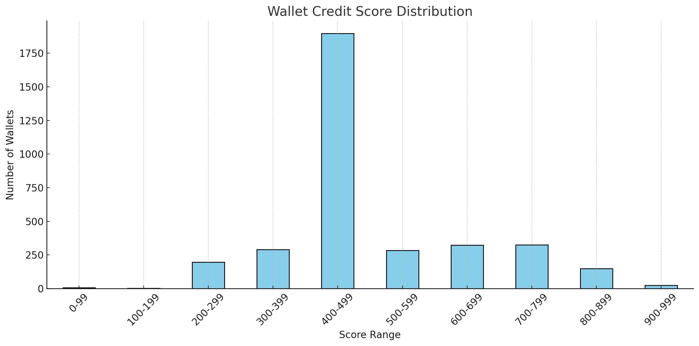

# 📊 Wallet Score Distribution & Behavioral Analysis

This report provides insights from the generated credit scores for DeFi wallets based on their transaction behavior on Aave V2.

## 📊 Score Distribution

Wallets were grouped into the following credit score ranges:

| Score Range | Description |
|-------------|-------------|
| 0-99        | Very high risk |
| 100-199     | Risky |
| 200-299     | Poor behavior |
| 300-399     | Below average |
| 400-499     | Moderate |
| 500-599     | Good |
| 600-699     | Very Good |
| 700-799     | Reliable |
| 800-899     | Excellent |
| 900-1000    | Exceptional |

### 📈 Distribution Plot

---

## 🔍 Low Score Behavior (0–200)

- **Total wallets**: 10
- **Avg Score**: 58.6
- **Traits**:
  - Low repayment activity
  - Often liquidated
  - Short lifespan (low wallet age)
  - High borrow-to-deposit ratio

🛑 These wallets may represent bots, risky actors, or borrowers defaulting repeatedly.

---

## 🟢 High Score Behavior (800–1000)

- **Total wallets**: 174
- **Avg Score**: 853.05
- **Traits**:
  - High-value deposits and repayments
  - Strong repayment-to-borrow ratio
  - Long wallet activity duration
  - No or very low liquidations

These are reliable users — likely long-term participants with healthy borrowing behavior.

---

## 🔚 Conclusion

- Most wallets fall in the **middle-to-high** range (400–900)
- Only a small fraction (<1%) exhibit truly risky behavior
- Behavioral scoring is a viable and transparent alternative for trust in DeFi protocols

---
